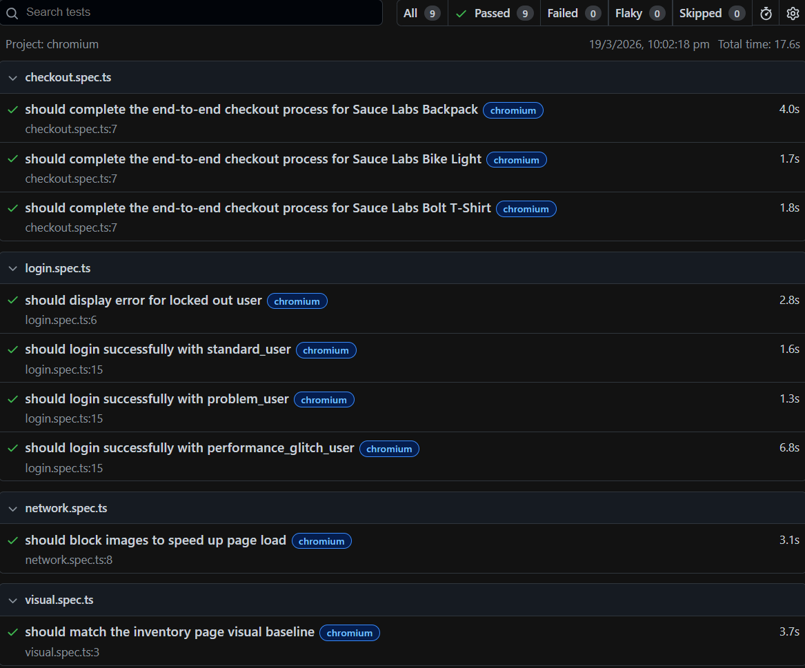

# Playwright E2E Test Suite — SauceDemo


A professional end-to-end test automation framework built with [Playwright](https://playwright.dev/) and TypeScript, targeting the [SauceDemo](https://www.saucedemo.com/) web application. This project demonstrates industry-standard testing practices including the Page Object Model, custom fixtures, data-driven testing, visual regression, and network interception.

---

## Tech Stack

| Tool                                          | Purpose                          |
| --------------------------------------------- | -------------------------------- |
| [Playwright](https://playwright.dev/)         | Cross-browser E2E test framework |
| [TypeScript](https://www.typescriptlang.org/) | Type-safe test authoring         |
| [Faker.js](https://fakerjs.dev/)              | Dynamic test data generation     |
| GitHub Actions                                | CI/CD pipeline                   |

---

## Test Report



---

## Project Structure

```
playwright-e2e-saucedemo/
├── .github/
│   └── workflows/
│       └── playwright.yml        # CI pipeline
├── fixtures/
│   └── auth.fixture.ts           # Reusable authenticated session fixture
├── page-objects/
│   └── pages/
│       ├── LoginPage.ts          # Login page interactions
│       ├── InventoryPage.ts      # Inventory/shop page interactions
│       └── CheckoutPage.ts       # Checkout flow interactions
├── test-data/
│   ├── users.json                # Valid test user accounts
│   └── products.json             # Products used in checkout tests
├── tests/
│   ├── login.spec.ts             # Login functionality tests
│   ├── checkout.spec.ts          # End-to-end checkout flow tests
│   ├── network.spec.ts           # Network interception tests
│   └── visual.spec.ts            # Visual regression tests
├── playwright.config.ts          # Playwright configuration
└── tsconfig.json                 # TypeScript configuration
```

---

## Key Features

### Page Object Model (POM)

All page interactions are encapsulated in dedicated page classes under `page-objects/pages/`. This keeps tests clean, readable, and easy to maintain — UI changes only require updates in one place.

### Custom Authentication Fixture

`fixtures/auth.fixture.ts` provides a `loggedInPage` fixture that handles login setup before each test. Tests that require an authenticated session simply declare `{ loggedInPage }` instead of repeating login logic.

### Data-Driven Testing

Tests are parametrised using JSON data files from `test-data/`:

- `users.json` — drives login tests across multiple user accounts
- `products.json` — drives checkout tests across multiple products

### Dynamic Test Data

Checkout tests generate realistic user details (first name, last name, postal code) at runtime using Faker.js, avoiding static data that can become stale.

### Visual Regression Testing

`visual.spec.ts` captures a pixel-perfect screenshot baseline of the inventory page and compares it on every run using Playwright's built-in `toHaveScreenshot()`. Baselines are scoped to Chromium to prevent cross-browser false positives, and snapshots for both Linux (CI) and Windows (local) are committed to the repository.

### Network Interception

`network.spec.ts` demonstrates Playwright's `page.route()` API to intercept and abort image requests, verifying that the application remains functional under constrained network conditions.

---

## Getting Started

### Prerequisites

- [Node.js](https://nodejs.org/) (LTS recommended)

### Installation

```bash
# Install dependencies
npm install

# Install Playwright browsers
npx playwright install
```

### Running Tests

```bash
# Run the full test suite (all browsers)
npx playwright test

# Run a specific test file
npx playwright test tests/checkout.spec.ts

# Run in headed mode (watch the browser)
npx playwright test --headed

# Run on a specific browser
npx playwright test --project=chromium

# Open the HTML report after a run
npx playwright show-report
```

### Updating Visual Snapshots

If intentional UI changes cause visual tests to fail, update the baseline screenshots with:

```bash
npx playwright test --update-snapshots
```

---

## Configuration

All Playwright settings live in `playwright.config.ts`. Key behaviours:

| Setting  | Local                     | CI                        |
| -------- | ------------------------- | ------------------------- |
| Headed   | Yes                       | No                        |
| Retries  | 0                         | 2                         |
| Workers  | Default                   | 1                         |
| Trace    | On failure                | On failure                |
| Video    | On failure                | On failure                |
| Browsers | Chromium, Firefox, WebKit | Chromium, Firefox, WebKit |

TypeScript path aliases are configured in `tsconfig.json` for clean imports:

| Alias         | Resolves To            |
| ------------- | ---------------------- |
| `@pages/*`    | `page-objects/pages/*` |
| `@fixtures/*` | `fixtures/*`           |
| `@data/*`     | `test-data/*`          |

---

## CI/CD

The GitHub Actions workflow (`.github/workflows/playwright.yml`) triggers on every push to `main` and:

1. Checks out the repository
2. Sets up Node.js (LTS)
3. Installs dependencies via `npm ci`
4. Installs Playwright browsers with system dependencies
5. Runs the full test suite
6. Uploads the HTML report as an artifact (retained for 14 days) on failure

---

## Test Coverage

| Area           | File               | Description                               |
| -------------- | ------------------ | ----------------------------------------- |
| Authentication | `login.spec.ts`    | Valid user logins + locked-out user error |
| Checkout       | `checkout.spec.ts` | Full E2E purchase flow per product        |
| Network        | `network.spec.ts`  | Image blocking via route interception     |
| Visual         | `visual.spec.ts`   | Inventory page screenshot regression      |
